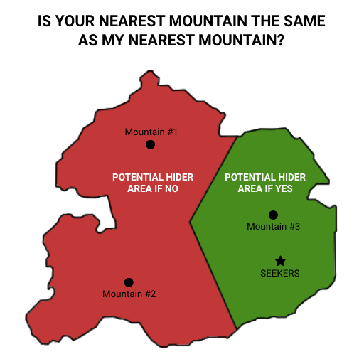

# Вопросы на совпадение

Формат вопроса:
«Является ли ваш ближайший ____ тем же, что и мой ____?»
Допустимые ответы: «да» или «нет». У прячущегося есть 5 минут на ответ.

Особенности:

Действительны на любом этапе игры.
Часто требуют перемещения ищущих для максимальной эффективности

Если объекты находятся за границами игровой карты — считаются несуществующими (ответ = null, но карты всё равно берутся)

После ответа прячущийся берёт 3 карты и оставляет 1

Пример:

Категории вопросов
## Транспорт
### Коммерческий аэропорт
Проверяется через Google Flights ([flights.google.com](https://flights.google.com)). Если аэропортов нет в границах карты — ответ null. 

### Линия транспорта
Условие: ищущие должны находиться в движущемся транспорте.
Ответ «да» только если их транспорт остановится на станции прячущегося (проезд без остановки = «нет»).

### Длина названия станции
Считаются все символы (включая пробелы и дефисы). Учитывается название в вашем картографическом приложении.

### Улица или дорога
Граница — смена названия. Безымянные пути ограничены перекрёстками.

## Административные деления
#### 1-й уровень
Штаты (США), кантоны (Швейцария), префектуры (Япония).

#### 2-й уровень
Округа (США), районы (Швейцария), субпрефектуры (Япония).

#### 3-й уровень
Муниципалитеты (границы могут быть неочевидны — уточняйте!).

#### 4-й уровень
Например, районы Нью-Йорка или специальные округа Токио (если есть).

## Природа
#### Гора
Определяется по иконке в приложении.

#### Массив суши
Непрерывная территория без водных преград. Если спорно — обсудите до игры.

#### Парк
Измеряется от иконки на карте (даже если вы внутри большого парка, но ближе к маленькому).

## Места интереса
#### Парк аттракционов

#### Зоопарк

#### Аквариум

#### Гольф-поле
Только полноценные поля (мини-гольф и driving range не считаются).

#### Музей

#### Кинотеатр

## Общественные объекты

#### Больница

#### Библиотека

#### Иностранное консульство
Почётные консульства не учитываются.

## Важно:

Все измерения производятся от иконки на карте (даже если это приводит к нелогичным результатам).

Ищущие должны чётко формулировать критерии (например, отправлять скриншот с отмеченными объектами).

Для спорных случаев рекомендуем договариваться до начала игры.
