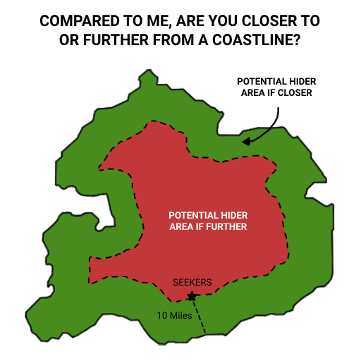
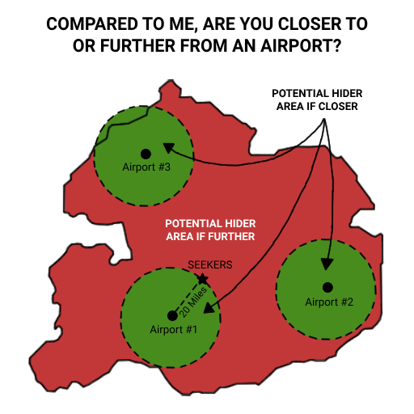
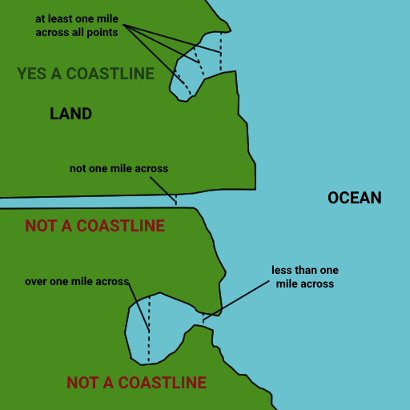

# Вопросы на измерение

Формат вопроса:
«По сравнению со мной, находитесь ли вы ближе или дальше от _____?»
Допустимые ответы: «ближе» или «дальше». У прячущегося есть 5 минут на ответ.

Эти вопросы универсально полезны и позволяют творчески разделять карту. 

#### Критически важно: если объекты находятся за границами игровой карты, они считаются несуществующими (ответ = null, но прячущийся всё равно берёт карту).

После ответа прячущийся может взять 3 карты и оставить 1.

Визуальные примеры:

# Полный список категорий
## Транспортные объекты
#### Коммерческий аэропорт
Аэропорт считается коммерческим, если его рейсы отображаются в Google Flights ([flights.google.com](https://flights.google.com)). При сомнениях проверяйте через этот сервис.

#### Скоростная железная дорога
Определение скорости зависит от страны. Рекомендуем стандарт ЕС:

≥250 км/ч на специализированных линиях

≈200 км/ч на модернизированных существующих линиях.

#### Железнодорожная станция
Включает станции метро, лёгкого метро и обычных поездов.

## Границы
#### Государственная граница
Учитываются анклавы — изолированные территории одного государства внутри другого.

#### Граница 1-го уровня адм. деления
Высший уровень административного деления: штаты (США), кантоны (Швейцария), префектуры (Япония).

#### Граница 2-го уровня адм. деления
Следующий уровень: округа (США), районы (Швейцария), субпрефектуры (Япония).

## Природные объекты
#### Уровень моря
Определяется по высоте над уровнем моря. Можно использовать компас смартфона, но учтите: показания часто неточны.

#### Водоём
Любой именованный природный или искусственный водоём (озёра, реки, пруды). Исключение: плавательные бассейны.

#### Береговая линия
Определяется как точка встречи суши с:

Океаном

Крупным озером (например, Великие озёра)

Водоёмом, соединённым с океаном/крупным озером через протоку шириной ≥1 мили.

Совет: не полагайтесь на абсолютную точность, обсуждайте спорные случаи.

#### Гора
Объекты с классификацией «гора» в вашем картографическом приложении. Расстояние измеряется от иконки на карте.

#### Парк
Объекты с классификацией «парк» в вашем картографическом приложении. Измерение ведётся от иконки, что может создавать парадоксы (например, если вы внутри большого парка, но ближе к иконке маленького).

## Места интереса
#### Парк аттракционов
Объекты с классификацией «Парк, Сквер» в вашем картографическом приложении. Расстояние измеряется от иконки на карте.

#### Зоопарк
Объекты с классификацией «зоопарк» в вашем картографическом приложении. Расстояние измеряется от иконки на карте.

#### Аквариум
Объекты с классификацией «аквариум» в вашем картографическом приложении. Расстояние измеряется от иконки на карте.

#### Поле для гольфа
Только полноразмерные открытые поля.
Не учитываются:

Мини-гольф

Тренировочные драйв-рейнджи.
Расстояние измеряется от иконки на карте.
Ищущие должны чётко обозначать критерии при задании вопроса.

#### Музей
Объекты с классификацией «музей» в вашем картографическом приложении. Расстояние измеряется от иконки на карте.

#### Кинотеатр
Объекты с классификацией «кинотеатр» в вашем картографическом приложении. Расстояние измеряется от иконки на карте.

## Общественные объекты
#### Больница
Объекты с классификацией «больница» в вашем картографическом приложении. Расстояние измеряется от иконки на карте.

#### Библиотека
Объекты с классификацией «библиотека» в вашем картографическом приложении. Расстояние измеряется от иконки на карте.

#### Иностранное консульство
Учитываются только официальные консульства.
Исключаются: почётные консульства.
Расстояние измеряется от иконки на карте.

## Ключевые правила для всех категорий
Измерение от иконки — основной метод, даже если он приводит к контринтуитивным результатам.

Спорные классификации (например, для гор или парков) определяются исключительно меткой в картографическом приложении.

Обязательное условие для вопросов о транспорте: ищущие должны находиться в движущемся транспорте.

Для береговой линии: при отсутствии чётких ориентиров решение принимается игроками до начала раунда.

