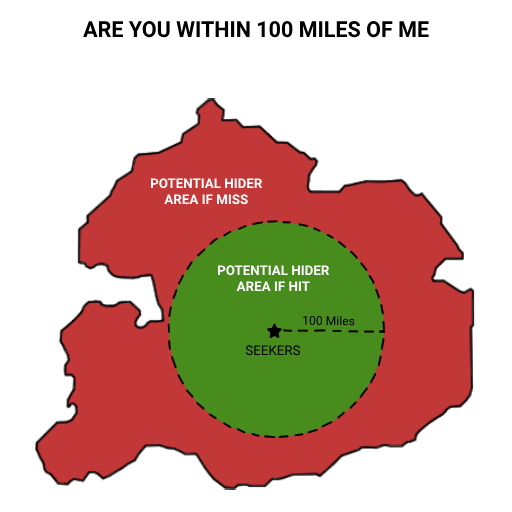

# Радарные вопросы

Радарные вопросы формулируются как:
«Ты находишься в пределах ____ от меня?»
Допустимыми ответами являются только «да» или «нет». На ответ у прячущегося игрока есть 5 минут.

Радарные вопросы — отличный способ проверить, находитесь ли вы в нужном районе, или исключить подозрительно плотную зону на карте. Удобнее всего измерять расстояние через Google Maps: зажмите точку или кликните правой кнопкой мыши и выберите инструмент "Измерить расстояние".

Важно: радар относится к вашему текущему положению, а не ко всей зоне, в которой вы прячетесь.
Если радар охватывает часть зоны, но не ту точку, в которой вы находитесь в момент ответа, — это считается промахом.

После ответа на радарный вопрос прячущийся игрок может вытянуть 2 карты и оставить 1 из них.

Вот наглядный пример как такой вопрос работает на карте:

Вот список радарных вопросов, которые могут задавать игроки, ищущие прячущегося. Все они следуют формату:

-   500 метров
-   1 километр
-   2 километра
-   5 километров
-   8 километров
-   15 километров
-   40 километров
-   80 километров
-   150 километров
-   Радар на выбор (Можете назначить любой радиус радара на ваш выбор)
