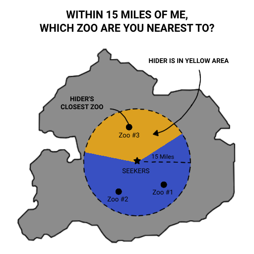

# Вопросы осьминоги

Эти вопросы формулируются так:

«В пределах ___ километров от меня, к какому ___ ты ближе всего? (Ты также должен находиться в пределах ___ километров)»

Если прячущийся действительно находится в пределах действия вопроса, он обязан ответить названием ближайшего из указанных объектов. Если он не находится в пределах зоны действия, он может просто ответить:
«Я вне зоны».

У прячущегося есть 5 минут, чтобы ответить на вопрос.

🧠 Подумай о вопросе-щупальце как о сети объектов — например, всех зоопарков — которые "вытягиваются" от ищущего игрока в разные стороны. Если одно из щупалец задевает прячущегося, оно "пингует" — и вы получаете точку отсчёта.

## После ответа прячущийся может вытянуть 4 карты и оставить 2.

Пример отображения вопроса-осьминога на карте:

## ⚠️ Вопросы-щупальца запрещены в маленьких играх.

## Доступные вопросы-щупальца в играх формата Средний:
(в пределах 1 км)

### Ближайший музей
Любое место, обозначенное как музей в вашем картографическом приложении.

### Ближайшая библиотека
Любое место, обозначенное как библиотека в вашем картографическом приложении.

### Ближайший кинотеатр
Любое место, обозначенное как кинотеатр в вашем картографическом приложении.

### Ближайшая больница
Любое место, обозначенное как больница в вашем картографическом приложении. Используются категории на вашей карте — например, Google Maps

## Дополнительно для игр формата Большой:
(в пределах 15 км)

### Ближайшая линия метро
Используйте цветные линии, отображаемые на Google Maps

### Ближайший зоопарк
Любое место, обозначенное как зоопарк в вашем картографическом приложении.

### Ближайший океанариум
Любое место, обозначенное как океанариум в вашем картографическом приложении.

### Ближайший парк аттракционов
Любое место, обозначенное как парк аттракционов в вашем картографическом приложении.

