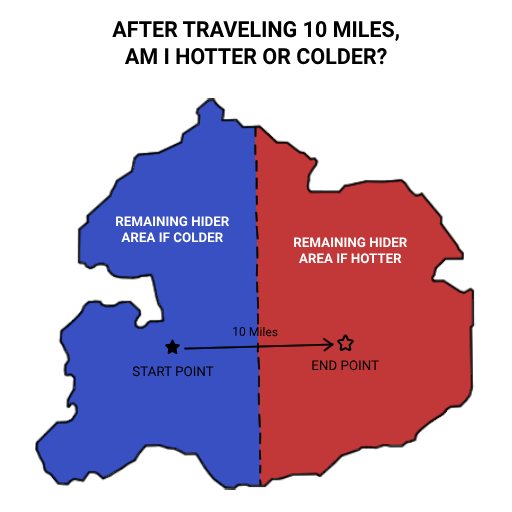

# Thermometer Questions

Thermometer questions follow the format, "After traveling \_\_\_\_, am I hotter or colder?" Valid answers are **hotter** or **colder**. Hiders have five minutes to answer. When starting a thermometer question, you should inform the hider that you are starting a thermometer and send them your current location (we recommend sending a pin through Google or Apple Maps.) Then, after traveling a sufficient distance–measured as the crow flies–send them your new location. If the new location is closer to the hider's current location, then you are hotter. Otherwise, you are colder. These questions are a good way of determining whether you are moving in the right direction.

After a thermometer question has been answered, the hider may **draw 2 cards and keep 1**.

Here's a little diagram to help illustrate how thermometer questions can work:

import LabelPill from '@site/src/components/LabelPill';

These are the thermometer questions available to the seekers in <LabelPill label='SMALL'/> **sized games**:

- ½ Mile
- 3 Miles

### For <LabelPill label='MEDIUM' fontSize='1rem'/> and <LabelPill label='LARGE' fontSize='1rem'/> Sized Games, Add the Following:

- 10 Miles

### For <LabelPill label='LARGE' fontSize='1rem'/> Sized Games, Add the Following:

- 50 Miles
